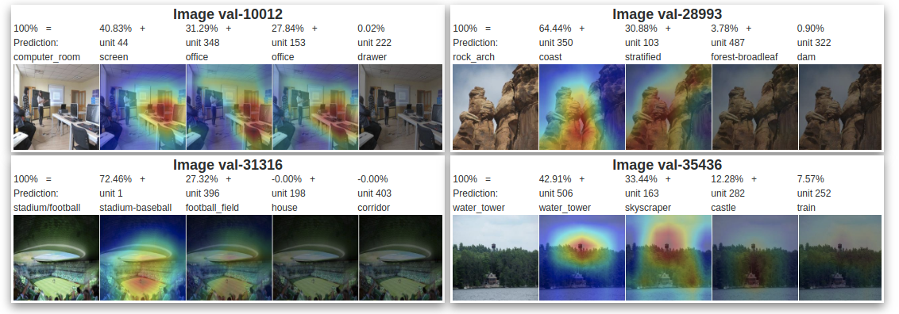

# Dynamic-K Activation

## Introduction
This repository contains the demo code for the ICCV'19 paper "Adaptive Activation Thresholding: Dynamic Routing Type Behavior for Interpretability in Convolutional Neural Networks".


## Download
* Clone the code of DKA from github
```
    git clone https://github.com/sunyiyou/dynamic-k-activation
    cd dynamic-k-activation
```

* If you want to train and test a new model instead of just running a demo. Then you may need to include the netdissect
module with command below
```
    git clone --recursive https://github.com/sunyiyou/dynamic-k-activation
```
## Requirements

* Python3.6 Environments

```
    pip3 install numpy sklearn scipy scikit-image matplotlib easydict torch torchvision
```

* [Places365](http://data.csail.mit.edu/places/places365/places365standard_easyformat.tar) dataset. Put it in $PLACES_ROOT and create a soft link by   
```
    mkdir data
    ln -s $PLACES_ROOT data/places365_standard
```

Note: The repo was written by pytorch-1.0.1. ([PyTorch](http://pytorch.org/), [Torchvision](https://github.com/pytorch/vision))

## Test Network with Dynamic-K Activation

* Test Resnet-d5a
```
    python3 demo.py
```


## DKA Result

* At the end of the dissection script, a HTML-formatted report will be generated inside `result` folder that summarizes the interpretable units of the tested network.


## Train Network with Dynamic-K Activation


* Run the train script.

```
    python3 train.py --mark t[K]
```

The models are stored in 'snapshot' folder. Set $MODELFILE to any snapshotted model.

* Generate Netdissection results.

Specifically, you have to change the folder to "netdissect" and change the "MODEL_FILE" in settings.py.
Then you have to download Broaden dataset by the given script and simply run ` python3 main.py`. When finished, set the $ND_RESULT to the path of 'tally.csv' in results folder.

Please see instructions of [Netdissect-Lite](https://github.com/sunyiyou/NetDissect-Lite-dka) for more details.


* Then generate DKA results.

```
    python3 demo.py --mark t[K] --nd_result $ND_RESULT --modelfile $MODELFILE
```

## Reference
If you find the codes useful, please cite this paper
```
@inproceedings{DKA2019,
  title={Adaptive Activation Thresholding: Dynamic Routing Type Behavior for Interpretability in Convolutional Neural Networks},
  author={Sun, Yiyou and Ravi, Sathya and Singh, Vikas},
  booktitle={International Conference on Computer Vision},
  year={2019}
}
```
